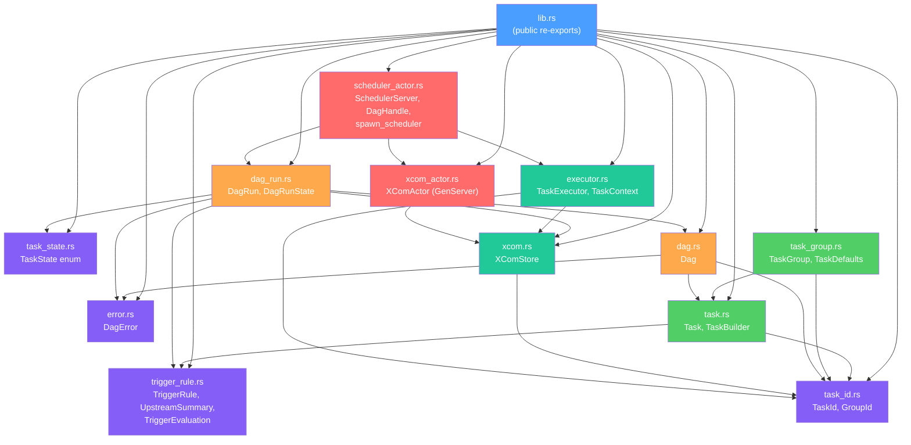
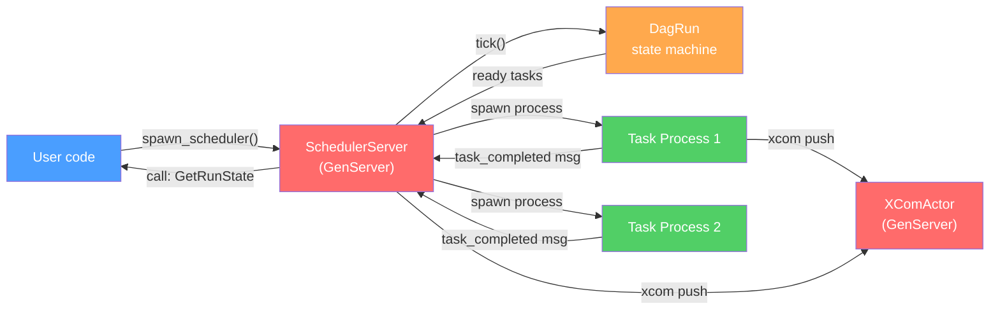

# Architecture

## Crate Module Structure

## Layered Design

The crate is organized in four layers. Each layer depends only on the layers below it.

### Layer 1: Pure Types (purple)

`task_id`, `task_state`, `trigger_rule`, `error`

These modules define value types with no runtime dependencies. `TaskState` is a `Copy` enum, `TriggerRule` is a pure function from `UpstreamSummary` to `TriggerEvaluation`, and `DagError` uses `thiserror` for display. Everything here is testable without async or I/O.

### Layer 2: DAG Structure (green)

`task`, `task_group`, `dag`

The `Task` struct holds the definition of a single unit of work -- its ID, trigger rule, retry count, pool, and group. `TaskBuilder` provides a fluent construction API. `TaskGroup` adds hierarchical namespacing. `Dag` is the graph itself: a `HashMap` of tasks with adjacency lists for upstream/downstream edges, plus topological sort via Kahn's algorithm.

### Layer 3: State Machine (orange)

`dag_run`, `xcom`, `executor`

`DagRun` is the runtime instantiation of a `Dag`. It owns the `HashMap<TaskId, TaskState>` that tracks every task's current state, enforces valid transitions (e.g., only `Running` can move to `Success`), and evaluates trigger rules on each `tick()` to propagate skips and upstream failures. `XComStore` is a nested `HashMap` for cross-task data. `TaskExecutor` is the trait users implement.

### Layer 4: Actors (red)

`scheduler_actor`, `xcom_actor`

This layer maps the state machine onto Rebar's actor model. `SchedulerServer` is a `GenServer` whose state is a `DagRun`. It receives `Tick` casts and `task_completed` info messages, dispatches ready tasks as spawned Rebar processes, and updates state accordingly. `XComActor` is a `GenServer` that provides serialized access to shared XCom data. `DagHandle` is the user-facing async API.

## Data Flow

### Execution Lifecycle

1. **Spawn** -- `spawn_scheduler()` creates a `DagRun`, an `XComActor`, and a `SchedulerServer`. It sends an initial `Tick` cast.

2. **Tick** -- The scheduler calls `dag_run.tick()`, which propagates upstream failures/skips and returns the list of ready `TaskId`s.

3. **Dispatch** -- For each ready task, the scheduler calls `mark_running()` and spawns a Rebar process that runs the corresponding `TaskExecutor::execute()`.

4. **Completion** -- When a task process finishes, it sends a `task_completed` JSON message back to the scheduler's `handle_info`. The scheduler calls `mark_success()` or `mark_failed()`, then ticks again.

5. **Retry** -- If a task fails and has remaining retries, `mark_failed()` transitions it to `UpForRetry` instead of `Failed`. The next tick picks it up as a ready task.

6. **Terminal** -- When all tasks reach terminal states, `update_run_state()` sets the `DagRunState` to `Success` (all ok) or `Failed` (any failure). The `DagHandle::wait_for_completion()` future resolves.
