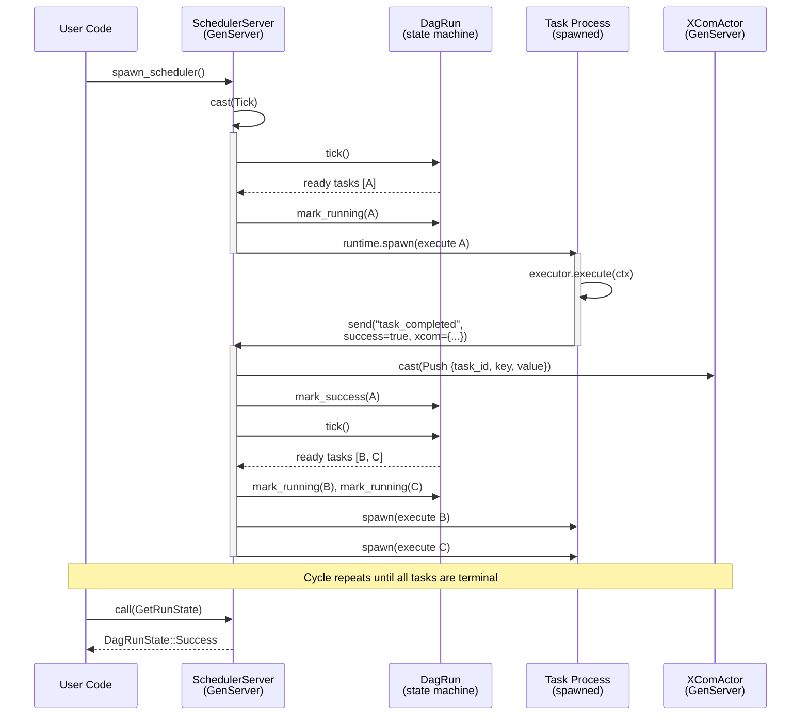

# Rebar Integration

## Message Flow



## Actor Mapping

| Airflow Concept | Rebar Actor | Module |
|----------------|-------------|--------|
| Scheduler | `SchedulerServer` (GenServer) | `scheduler_actor.rs` |
| Task Instance execution | Spawned Rebar process | `scheduler_actor.rs` (`dispatch_ready_tasks`) |
| XCom backend | `XComActor` (GenServer) | `xcom_actor.rs` |
| DAG Run state | `DagRun` (owned by SchedulerServer) | `dag_run.rs` |
| Operator / Task logic | `TaskExecutor` trait impl | `executor.rs` |
| DAG Run handle | `DagHandle` (wraps `GenServerRef`) | `scheduler_actor.rs` |

## How XCom Flows Through the XComActor

XCom (cross-communication) allows tasks to pass data to downstream tasks. The flow involves three stages:

### 1. Task Produces XCom

During execution, a task pushes values into its local `TaskContext`:

```rust
ctx.xcom_push("return_value", json!({"row_count": 1000}));
```

This writes to a local `XComStore` inside the `TaskContext`. The data does not leave the task process yet.

### 2. Completion Message Carries XCom

When the task process finishes, it serializes all XCom values into the `task_completed` message sent back to the scheduler:

```json
{
    "type": "task_completed",
    "task_id": "extract",
    "success": true,
    "xcom": {
        "return_value": {"row_count": 1000}
    }
}
```

### 3. Scheduler Pushes to XComActor

In `handle_info`, the scheduler extracts the xcom map and casts `Push` messages to the `XComActor`:

```rust
xcom_ref.cast(XComCast::Push {
    task_id: task_id.clone(),
    key,
    value,
}).ok();
```

The `XComActor` is a `GenServer` with serialized access, so concurrent pushes from multiple task completions are safe.

### Reading XCom

Any code with a reference to the `XComActor` can read values via `call`:

```rust
let reply = xcom_ref.call(
    XComCall::Pull { task_id: TaskId::new("extract"), key: "return_value".into() },
    Duration::from_secs(1),
).await.unwrap();
```

## Supervision and Fault Tolerance

Rebar provides process-level isolation. Each task runs in its own spawned process:

- **Isolation** -- A panic or error in one task process does not crash the scheduler or other tasks.
- **Completion signaling** -- Every task process sends a `task_completed` message back to the scheduler, reporting success or failure.
- **Retry handling** -- When a task fails and has remaining retries, the scheduler transitions it to `UpForRetry`. On the next tick, it appears in the ready list and is dispatched as a new process.
- **Scheduler resilience** -- The `SchedulerServer` itself is a GenServer. If it were placed under a Rebar supervisor, it could be restarted on crash (though current usage spawns it directly).

## Using spawn_scheduler

`spawn_scheduler` is the main entry point. It wires up the DAG, executors, runtime, and actors:

```rust
use airflow_dag::*;
use std::collections::HashMap;
use std::sync::Arc;
use std::time::Duration;

// Define task logic
struct ExtractExecutor;

#[async_trait::async_trait]
impl TaskExecutor for ExtractExecutor {
    async fn execute(
        &self,
        ctx: &mut TaskContext,
    ) -> Result<(), Box<dyn std::error::Error + Send + Sync>> {
        // Do work...
        ctx.xcom_push("rows", serde_json::json!(500));
        Ok(())
    }
}

struct LoadExecutor;

#[async_trait::async_trait]
impl TaskExecutor for LoadExecutor {
    async fn execute(
        &self,
        ctx: &mut TaskContext,
    ) -> Result<(), Box<dyn std::error::Error + Send + Sync>> {
        // Do work...
        Ok(())
    }
}

async fn run_pipeline() {
    // Build DAG
    let mut dag = Dag::new("my_pipeline");
    dag.add_task(Task::builder("extract").retries(2).build()).unwrap();
    dag.add_task(Task::builder("load").build()).unwrap();
    dag.set_downstream(&TaskId::new("extract"), &TaskId::new("load")).unwrap();

    // Map each task to its executor
    let mut executors: HashMap<TaskId, Arc<dyn TaskExecutor>> = HashMap::new();
    executors.insert(TaskId::new("extract"), Arc::new(ExtractExecutor));
    executors.insert(TaskId::new("load"), Arc::new(LoadExecutor));

    // Create Rebar runtime and spawn the scheduler
    let runtime = Arc::new(rebar::runtime::Runtime::new(4));
    let handle = spawn_scheduler(
        runtime,
        dag,
        executors,
        "run_001",
        chrono::Utc::now(),
    ).await;

    // Query state at any time
    let run_state = handle.run_state().await.unwrap();
    println!("Current state: {:?}", run_state);

    // Wait for completion
    let final_state = handle
        .wait_for_completion(
            Duration::from_millis(50),
            Duration::from_secs(60),
        )
        .await
        .unwrap();

    println!("Pipeline finished: {:?}", final_state);

    // Query individual task states
    let extract_state = handle.task_state(&TaskId::new("extract")).await.unwrap();
    let load_state = handle.task_state(&TaskId::new("load")).await.unwrap();
    println!("extract: {:?}, load: {:?}", extract_state, load_state);
}
```

### DagHandle API

The `DagHandle` returned by `spawn_scheduler` provides these async methods:

| Method | Return Type | Description |
|--------|------------|-------------|
| `run_state()` | `DagRunState` | Current overall run state |
| `task_state(id)` | `TaskState` | State of a specific task |
| `all_task_states()` | `HashMap<TaskId, TaskState>` | Snapshot of all task states |
| `is_complete()` | `bool` | Whether the run has finished |
| `wait_for_completion(poll, timeout)` | `DagRunState` | Block until done or timeout |

All methods communicate with the `SchedulerServer` via GenServer `call` messages, so they are safe to use from any async context.
