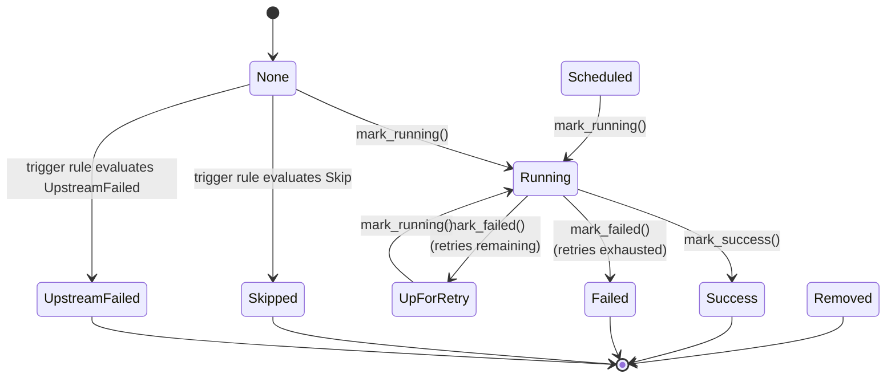

# State Machine

## TaskState Transitions



### State Classification

| State | Terminal | Description |
|-------|---------|-------------|
| `None` | No | Initial state before any scheduling decision |
| `Scheduled` | No | Scheduler has marked it for execution |
| `Queued` | No | Placed in an execution queue |
| `Running` | No | Currently executing in a task process |
| `UpForRetry` | No | Failed but will be retried (attempts remaining) |
| `Success` | **Yes** | Completed successfully |
| `Failed` | **Yes** | Execution failed with no retries remaining |
| `Skipped` | **Yes** | Skipped due to trigger rule (e.g., branch not taken) |
| `UpstreamFailed` | **Yes** | An upstream dependency failed |
| `Removed` | **Yes** | Removed from the DAG run |

Terminal states are checked via `TaskState::is_finished()`. The DAG run is complete when every task is in a terminal state.

### Failure Classification

`TaskState::is_failure()` returns `true` for:
- `Failed` -- the task itself failed
- `UpstreamFailed` -- an upstream dependency failed

This distinction matters for trigger rule evaluation. A task in `UpstreamFailed` counts as a failure from the perspective of its own downstream tasks.

## Transition Matrix

Valid transitions enforced by `DagRun`. Rows are the current state, columns are the target state.

| From / To | None | Scheduled | Queued | Running | Success | Failed | Skipped | UpstreamFailed | UpForRetry | Removed |
|-----------|------|-----------|--------|---------|---------|--------|---------|----------------|------------|---------|
| **None** | - | - | - | Yes | - | - | Yes | Yes | - | - |
| **Scheduled** | - | - | - | Yes | - | - | - | - | - | - |
| **Queued** | - | - | - | - | - | - | - | - | - | - |
| **Running** | - | - | - | - | Yes | Yes | - | - | Yes | - |
| **Success** | - | - | - | - | - | - | - | - | - | - |
| **Failed** | - | - | - | - | - | - | - | - | - | - |
| **Skipped** | - | - | - | - | - | - | - | - | - | - |
| **UpstreamFailed** | - | - | - | - | - | - | - | - | - | - |
| **UpForRetry** | - | - | - | Yes | - | - | - | - | - | - |
| **Removed** | - | - | - | - | - | - | - | - | - | - |

Notes:
- `Running` to `Failed` vs `UpForRetry` is decided by `should_retry()`: if `attempt_count <= task.retries`, the transition goes to `UpForRetry`.
- `None` to `Skipped`/`UpstreamFailed` happens during `tick()` when trigger rule evaluation returns `Skip` or `UpstreamFailed`.
- `None` to `Running` is the normal path for root tasks or tasks whose upstreams all succeeded.
- All terminal states are absorbing -- no outbound transitions.
- Invalid transitions return `DagError::InvalidStateTransition`.

## DagRunState

```mermaid
stateDiagram-v2
    [*] --> Queued : DagRun::new()
    Queued --> Running : first task starts
    Running --> Success : all tasks terminal,<br>none failed
    Running --> Failed : all tasks terminal,<br>any failed
    Success --> [*]
    Failed --> [*]
```

| State | Meaning |
|-------|---------|
| `Queued` | DAG run created, no tasks have started yet |
| `Running` | At least one task is active (Running, Queued, Scheduled, or UpForRetry) |
| `Success` | All tasks reached terminal states and none are in a failure state |
| `Failed` | All tasks reached terminal states and at least one is `Failed` or `UpstreamFailed` |

The run state is recomputed by `update_run_state()` after every task state change. It will not transition to `Success` or `Failed` until `is_complete()` returns `true` (all tasks in terminal states).
