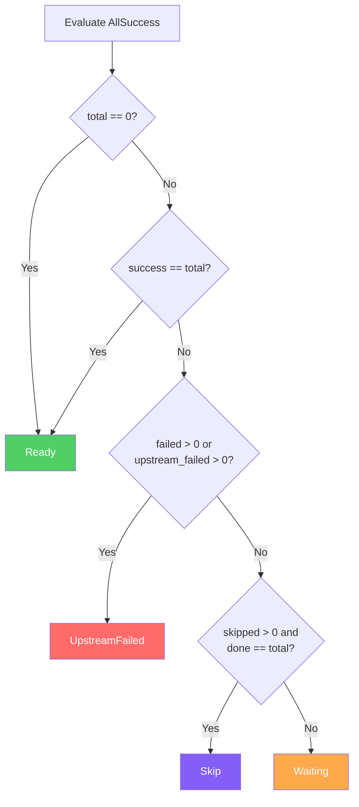

# Trigger Rules

## Overview

A trigger rule determines when a task should execute based on the terminal states of its upstream dependencies. Each task has exactly one trigger rule (default: `AllSuccess`). The rule is evaluated by computing an `UpstreamSummary` and calling `TriggerRule::evaluate()`, which returns one of:

| Result | Meaning |
|--------|---------|
| `Ready` | Task should be scheduled for execution |
| `Waiting` | Upstreams are still running; check again later |
| `Skip` | Task should be marked `Skipped` |
| `UpstreamFailed` | Task should be marked `UpstreamFailed` |

If a task has **no upstream dependencies**, all trigger rules return `Ready` (vacuously satisfied).

## Rule Reference

| Rule | Default | Description |
|------|---------|-------------|
| `AllSuccess` | Yes | All upstreams must succeed |
| `AllFailed` | | All upstreams must be in a failed state (Failed or UpstreamFailed) |
| `AllDone` | | All upstreams must be in any terminal state |
| `AllDoneMinOneSuccess` | | All upstreams done and at least one succeeded |
| `AllSkipped` | | All upstreams must be Skipped |
| `OneSuccess` | | At least one upstream succeeded (does not wait for all) |
| `OneFailed` | | At least one upstream failed (does not wait for all) |
| `OneDone` | | At least one upstream reached any terminal state |
| `NoneFailed` | | No upstreams failed; all done with Success, Skipped, or Removed |
| `NoneFailedMinOneSuccess` | | No failures, all done, and at least one Success |
| `NoneSkipped` | | No upstreams were skipped; all done |
| `Always` | | Fires immediately regardless of upstream states |

## Truth Tables

Each table shows the evaluation result given different upstream state combinations. Upstream states are abbreviated: S = Success, F = Failed, UF = UpstreamFailed, Sk = Skipped, R = Running, N = None.

### AllSuccess

| Upstreams | Result |
|-----------|--------|
| All S | Ready |
| Any F or UF | UpstreamFailed |
| All done, some Sk, no F/UF | Skip |
| Any still R/N/Queued | Waiting |

### AllFailed

| Upstreams | Result |
|-----------|--------|
| All F or UF | Ready |
| All done, not all failed | Skip |
| Any S or Sk (even with running) | Skip |
| Some F, rest still running | Waiting |

### AllDone

| Upstreams | Result |
|-----------|--------|
| All in terminal state | Ready |
| Any non-terminal | Waiting |

### AllDoneMinOneSuccess

| Upstreams | Result |
|-----------|--------|
| All done, at least one S | Ready |
| All done, zero S | Skip |
| Any non-terminal | Waiting |

### AllSkipped

| Upstreams | Result |
|-----------|--------|
| All Sk | Ready |
| All done or any S/F/UF present | Skip |
| Some Sk, rest still running | Waiting |

### OneSuccess

| Upstreams | Result |
|-----------|--------|
| At least one S | Ready |
| All done, zero S | UpstreamFailed |
| No S yet, some still running | Waiting |

### OneFailed

| Upstreams | Result |
|-----------|--------|
| At least one F or UF | Ready |
| All done, zero F/UF | Skip |
| No F/UF yet, some still running | Waiting |

### OneDone

| Upstreams | Result |
|-----------|--------|
| At least one terminal | Ready |
| All non-terminal | Waiting |

### NoneFailed

| Upstreams | Result |
|-----------|--------|
| Any F or UF | UpstreamFailed |
| All done, zero F/UF | Ready |
| No F/UF, some still running | Waiting |

### NoneFailedMinOneSuccess

| Upstreams | Result |
|-----------|--------|
| Any F or UF | UpstreamFailed |
| All done, zero F/UF, at least one S | Ready |
| All done, zero F/UF, zero S | Skip |
| No F/UF, some still running | Waiting |

### NoneSkipped

| Upstreams | Result |
|-----------|--------|
| Any Sk | Skip |
| All done, zero Sk | Ready |
| No Sk, some still running | Waiting |

### Always

| Upstreams | Result |
|-----------|--------|
| Any combination | Ready |

## Evaluation Flowchart: AllSuccess

This flowchart demonstrates the evaluation logic for the default `AllSuccess` rule. Other rules follow a similar pattern with different conditions.



## Practical Examples

### After a Branch: Use NoneFailedMinOneSuccess

When a `BranchOperator` skips some branches, the join task downstream needs to tolerate skipped upstreams while still requiring at least one real success:

```rust
//     branch_op
//     /       \
//  path_a   path_b
//     \       /
//      join_task (NoneFailedMinOneSuccess)

dag.add_task(Task::builder("join_task")
    .trigger_rule(TriggerRule::NoneFailedMinOneSuccess)
    .build()).unwrap();
```

If `path_a` succeeds and `path_b` is skipped, `join_task` fires. If both are skipped, it is skipped too.

### Cleanup After Any Outcome: Use Always

A cleanup task that must run regardless of whether upstreams succeeded or failed:

```rust
dag.add_task(Task::builder("cleanup")
    .trigger_rule(TriggerRule::Always)
    .build()).unwrap();
```

### Alert on Any Failure: Use OneFailed

Fire an alert task as soon as any upstream fails, without waiting for the rest to finish:

```rust
dag.add_task(Task::builder("send_alert")
    .trigger_rule(TriggerRule::OneFailed)
    .build()).unwrap();
```

### Wait for Everything, Regardless of Outcome: Use AllDone

A reporting task that needs all upstream work to be finished (success, failure, or skip) before summarizing:

```rust
dag.add_task(Task::builder("generate_report")
    .trigger_rule(TriggerRule::AllDone)
    .build()).unwrap();
```
